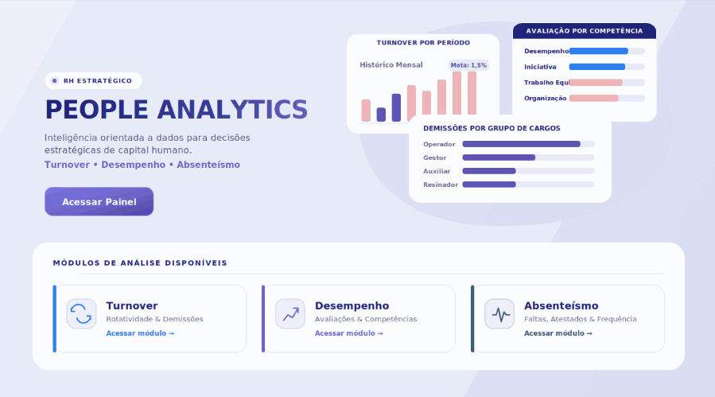
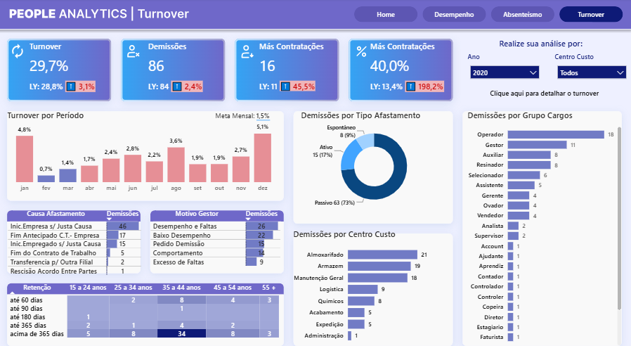
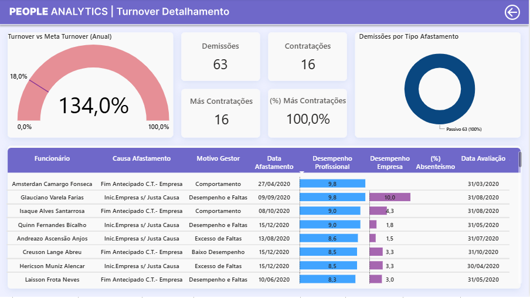
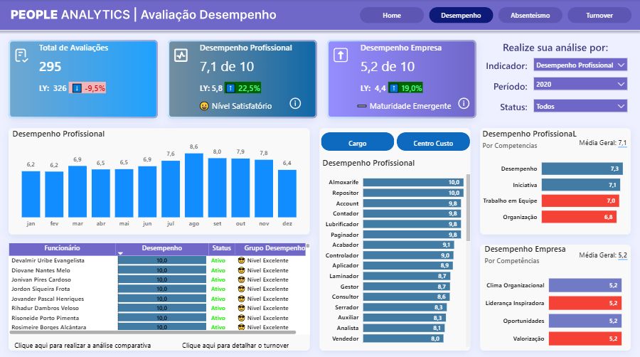
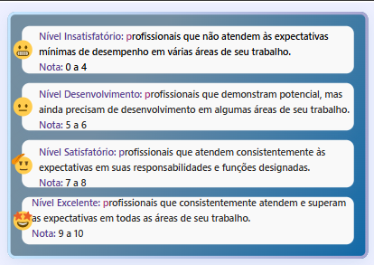
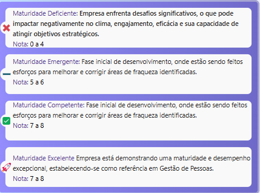
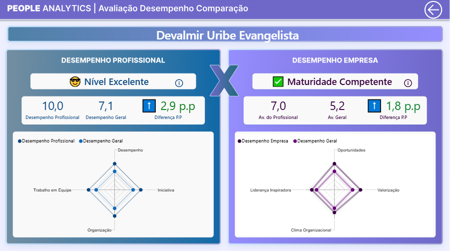
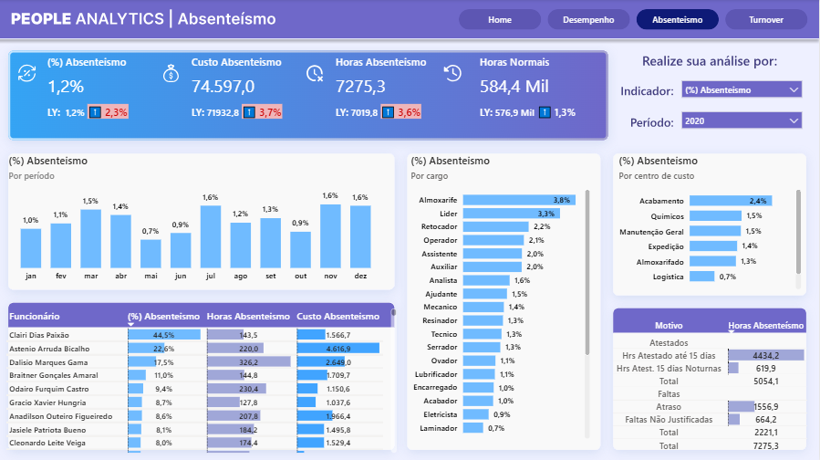

# 🧑‍💼 People Analytics — Turnover, Desempenho e Absenteísmo

> **Dashboard analítico desenvolvido no Microsoft Power BI** para explorar indicadores estratégicos de gestão de pessoas, com foco em turnover demissional, desempenho profissional, percepção organizacional e absenteísmo.
>
> 🎓 Projeto profissional adaptado para fins metodológicos e educacionais. Os dados utilizados são fictícios, e as medidas foram ajustadas à realidade deste dataset demonstrativo.



<p align="center">
  <strong>Turnover • Desempenho • Absenteísmo</strong>
</p>

---

## 📌 Visão geral

Este projeto integra dados de Recursos Humanos em um modelo analítico no **Power BI**, permitindo analisar indicadores de gestão de pessoas por diferentes perspectivas organizacionais e temporais.

A solução permite explorar informações por:

- Período
- Funcionário
- Departamento
- Cargo
- Unidade
- Centro de custo
- Motivo de desligamento
- Tipo de afastamento
- Ocorrências de absenteísmo
- Competências avaliadas

O dashboard foi estruturado em três módulos principais:

| Módulo | Objetivo |
|---|---|
| 🔁 Turnover | Analisar desligamentos, contratações, turnover, causas de afastamento e possíveis más contratações |
| ⭐ Desempenho | Avaliar desempenho profissional, competências e percepção dos funcionários sobre a organização |
| 🕒 Absenteísmo | Monitorar horas ausentes, custos, motivos, cargos e centros de custo com maior incidência |

A solução foi construída com:

- 🧹 Preparação e transformação de dados no **Power Query**
- 🧠 Modelagem semântica no **Power BI**
- 🧮 Medidas analíticas em **DAX**
- 📅 Calendário para análises mensais, anuais e comparações temporais
- 📊 Dashboards interativos com filtros, KPIs e análises detalhadas
- 🗂️ Git e GitHub para versionamento e documentação

---

## 🎯 Objetivos

Os objetivos específicos do projeto são:

- Descrever a evolução dos principais indicadores de gestão de pessoas
- Calcular turnover, headcount, absenteísmo e contratações malsucedidas
- Comparar os indicadores de 2020 com os resultados de 2019
- Analisar desligamentos por período, departamento, cargo, centro de custo e motivo
- Avaliar o desempenho profissional e a percepção dos funcionários sobre a organização
- Cruzar informações de desligamento, desempenho e absenteísmo
- Identificar possíveis desligamentos de profissionais com desempenho elevado
- Disponibilizar os resultados em dashboards interativos para apoio à análise gerencial

---

## 📊 Principais resultados

Os resultados abaixo correspondem ao recorte analisado no projeto:

| Indicador | Resultado |
|---|---:|
| Funcionários distintos analisados | **859** |
| Turnover demissional em 2020 | **29,7%** |
| Turnover demissional em 2019 | **28,8%** |
| Desligamentos em 2020 | **86** |
| Desligamentos em 2019 | **84** |
| Absenteísmo em 2020 | **1,2%** |
| Desempenho profissional médio | **7,1 / 10** |
| Desempenho organizacional médio | **5,2 / 10** |
| Contratações malsucedidas em 2020 | **16** |

> A análise identificou desligamentos envolvendo profissionais com desempenho elevado e baixo absenteísmo. Portanto, os dados não sustentam a interpretação de que todos os desligamentos sejam explicados exclusivamente por baixo desempenho e alto absenteísmo.

---

## 🔁 Módulo de turnover

O módulo de turnover permite acompanhar a movimentação de funcionários e investigar os principais fatores relacionados aos desligamentos.

Entre as análises disponíveis estão:

- Turnover mensal e anual
- Comparação com metas de turnover
- Desligamentos por tipo de afastamento
- Desligamentos por grupo de cargos
- Desligamentos por centro de custo
- Causa de afastamento e motivo informado pelo gestor
- Perfil de retenção por faixa etária e tempo de empresa
- Identificação de contratações malsucedidas



> A página principal de turnover consolida indicadores de desligamentos, turnover, más contratações, causas de afastamento, motivos gerenciais, centros de custo e grupos de cargos.

### 🔎 Detalhamento dos desligamentos

A página de detalhamento permite investigar os desligamentos individualmente, cruzando informações como causa de afastamento, motivo do gestor, data de desligamento, desempenho profissional, percepção da empresa e taxa de absenteísmo.



> Essa visão é importante para evitar interpretações simplificadas. Um desligamento pode envolver fatores distintos, e os indicadores de desempenho ou absenteísmo não devem ser analisados isoladamente.

---

## ⭐ Módulo de desempenho

O módulo de desempenho apresenta indicadores relacionados às avaliações profissionais e à percepção dos funcionários sobre a organização.

As análises incluem:

- Média de desempenho profissional
- Média de desempenho organizacional
- Evolução mensal das avaliações
- Comparação entre desempenho individual e média geral
- Desempenho por cargo
- Avaliação por competências
- Listagem de funcionários e status de desempenho
- Análise individual comparativa



> A análise permite acompanhar competências como desempenho, iniciativa, trabalho em equipe e organização, além de indicadores relacionados ao clima organizacional, liderança, oportunidades e valorização.

### 📚 Metodologia de classificação

Para facilitar a interpretação dos resultados, o dashboard transforma as notas médias em faixas qualitativas de desempenho profissional e maturidade organizacional.

Essas classificações são apresentadas nos cartões, tabelas, gráficos e comparações individuais, permitindo que uma nota numérica seja interpretada em um contexto analítico mais claro.

#### 👤 Classificação do desempenho profissional

A avaliação do desempenho profissional é classificada em quatro níveis:

| Faixa de nota | Classificação | Interpretação |
|---:|---|---|
| 0 a 4 | Insatisfatório | Profissionais que não atendem às expectativas mínimas de desempenho em várias áreas de seu trabalho |
| 5 a 6 | Em desenvolvimento | Profissionais que demonstram potencial, mas ainda precisam de desenvolvimento em algumas áreas de seu trabalho |
| 7 a 8 | Satisfatório | Profissionais que atendem consistentemente às expectativas em suas responsabilidades e funções designadas |
| 9 a 10 | Excelente | Profissionais que consistentemente atendem e superam as expectativas em todas as áreas de seu trabalho |



#### 🏢 Classificação da maturidade da empresa

A percepção sobre a empresa é classificada em quatro níveis de maturidade organizacional:

| Faixa de nota | Classificação | Interpretação |
|---:|---|---|
| 0 a 4 | Maturidade deficiente | A empresa enfrenta desafios significativos que podem impactar negativamente o clima, o engajamento, a eficácia e sua capacidade de atingir objetivos estratégicos |
| 5 a 6 | Maturidade emergente | A empresa está em fase inicial de desenvolvimento, realizando esforços para melhorar e corrigir áreas de fraqueza identificadas |
| 7 a 8 | Maturidade competente | A empresa demonstra capacidade de desenvolvimento e busca consolidar melhorias nas dimensões avaliadas |
| 9 a 10 | Maturidade excelente | A empresa demonstra maturidade e desempenho excepcional, estabelecendo-se como referência em Gestão de Pessoas |



> As categorias transformam médias numéricas em interpretações qualitativas. Elas apoiam a leitura dos indicadores, mas não substituem análises contextuais, avaliações qualitativas ou outras fontes de evidência organizacional.

### 🧑‍💼 Comparação individual de desempenho

A tela comparativa apresenta o desempenho de um funcionário em relação às médias gerais do conjunto analisado, separando as perspectivas de desempenho profissional e percepção sobre a empresa.



> A visualização utiliza gráficos de radar para comparar dimensões como desempenho, iniciativa, trabalho em equipe e organização, além de clima organizacional, liderança inspiradora, oportunidades e valorização.
>
> Essa análise deve ser usada como apoio à investigação dos dados, e não como critério isolado para decisões sobre pessoas.

---

## 🕒 Módulo de absenteísmo

O módulo de absenteísmo apresenta a distribuição das ausências, suas horas acumuladas, custos estimados e os principais motivos registrados.

Entre as análises disponíveis estão:

- Percentual de absenteísmo por período
- Horas de absenteísmo
- Horas normais trabalhadas
- Custo associado ao absenteísmo
- Absenteísmo por funcionário
- Absenteísmo por cargo
- Absenteísmo por centro de custo
- Horas por motivo de ocorrência



> A análise combina frequência, volume de horas e custo, permitindo identificar áreas, cargos e tipos de ocorrência com maior impacto nos indicadores de ausência.

---

## 🧮 Indicadores e regras de negócio

### 👥 Funcionários distintos

Contagem distinta dos funcionários registrados na dimensão `dFuncionarios`:

```DAX
Funcionários analisados =
DISTINCTCOUNT(
    dFuncionarios[Funcionário]
)
```

### ⭐ Desempenho profissional

Média das notas registradas nas avaliações profissionais, em escala de 0 a 10:

```DAX
Desempenho Profissional =
AVERAGE(
    'fAvaliaçãoDesempenho'[Nota]
)
```

### 🏢 Desempenho organizacional

Média das notas relacionadas à percepção sobre a organização:

```DAX
Desempenho Empresa =
AVERAGE(
    fDesempenhoEmpresa[Nota]
)
```

### 🕒 Absenteísmo

As horas de absenteísmo são compostas por atestados, atrasos e faltas não justificadas.

```DAX
Horas Absenteismo =
[Faltas Não Justificadas]
    + [Atrasos]
    + [Atestados]

(%) Absenteismo =
DIVIDE(
    [Horas Absenteismo],
    [Horas Normais]
)
```

Eventos utilizados no modelo:

| Tipo de ocorrência | Código do evento |
|---|---:|
| Horas normais | 1 e 100 |
| Atestados | 14 e 113 |
| Atrasos | 2457 |
| Faltas não justificadas | 3 |

### 🚪 Demissões

As demissões são identificadas pelo código de situação `7` e pela data de afastamento:

```DAX
Demissões =
CALCULATE(
    COUNTROWS(fContrato),
    fContrato[Cód Situação] = 7,
    USERELATIONSHIP(
        fContrato[Data Afastamento],
        dCalendario[Data]
    )
)
```

### 📈 Headcount

O headcount é calculado como o saldo acumulado de contratações menos demissões até a maior data disponível no contexto filtrado:

```DAX
Headcount =
VAR DataAtual =
    MAX(dCalendario[Data])
RETURN
    CALCULATE(
        [Contratações] - [Demissões],
        FILTER(
            ALL(dCalendario[Data]),
            dCalendario[Data] <= DataAtual
        )
    )
```

> **Observação:** como as medidas de contratações e demissões usam `COUNTROWS(fContrato)`, o headcount representa um saldo de registros de contrato. Ele não deve ser interpretado automaticamente como uma contagem distinta de pessoas.

### 🔁 Turnover

O turnover é calculado pela relação entre demissões e o headcount de referência anterior:

```DAX
Turnover =
DIVIDE(
    [Demissões],
    [(LM) Headcount],
    0
)
```

A medida de referência utiliza `PREVIOUSDAY`. Apesar do nome `(LM) Headcount`, ela representa a data imediatamente anterior ao contexto analisado e não necessariamente o mês anterior em todas as granularidades.

### ❌ Contratações malsucedidas

São consideradas malsucedidas as contratações com situação `7` e desligamento em até 60 dias após a admissão:

```DAX
Más Contratações =
CALCULATE(
    [Contratações],
    FILTER(
        fContrato,
        fContrato[Cód Situação] = 7
            && DATEDIFF(
                fContrato[Data Admissão],
                fContrato[Data Afastamento],
                DAY
            ) <= 60
    )
)
```

---

## 🗃️ Modelo de dados

O modelo foi estruturado com tabelas fato e dimensões relacionadas por funcionários, datas e chaves organizacionais.

### Principais tabelas

| Tabela | Descrição |
|---|---|
| `fContrato` | Admissões, contratos, situações e desligamentos |
| `fFichaFinanceira` | Horas, eventos e valores financeiros relacionados ao absenteísmo |
| `fAvaliaçãoDesempenho` | Notas de desempenho profissional |
| `fDesempenhoEmpresa` | Avaliações de percepção sobre a organização |
| `dFuncionarios` | Dimensão de funcionários |
| `dCalendario` | Calendário utilizado nas análises temporais |
| Dimensões organizacionais | Departamento, cargo, unidade e centro de custo |

---

## 🗂️ Estrutura do repositório

```text
people_analytics/
├── README.md
├── people-analytics-turnover.pbix
├── artigo-cientifico.pdf
├── relatorio-empresarial.pdf
├── LICENSE
└── assets/
    ├── capa.PNG
    ├── turnover.PNG
    ├── desempenho.PNG
    ├── absenteismo.PNG
    ├── detalahamento_turnover.PNG
    ├── comparacao_desempenho.PNG
    ├── tooltip_profissional.PNG
    └── tooltip_empresa.PNG
```

---

## ▶️ Como visualizar o projeto

1. Instale o [Power BI Desktop](https://www.microsoft.com/power-platform/products/power-bi/desktop).

2. Clone este repositório:

   ```bash
   git clone https://github.com/VitorCamposAds/people_analytics.git
   ```

3. Acesse a pasta do projeto:

   ```bash
   cd people_analytics
   ```

4. Abra o arquivo `people-analytics-turnover.pbix` no Power BI Desktop.

5. Caso o Power BI solicite a atualização das fontes, ajuste os caminhos ou conexões de dados necessários.

6. Atualize os dados somente se possuir autorização para utilizá-los.

7. Navegue pelas páginas do relatório e utilize os filtros para explorar os indicadores.

---

## ⚠️ Limitações

- A análise contempla apenas os anos de **2019** e **2020**.
- O estudo possui caráter **descritivo e exploratório**.
- Os resultados não demonstram relações de causa e efeito.
- A qualidade dos indicadores depende da completude, padronização e consistência dos registros administrativos.
- Avaliações de desempenho podem apresentar subjetividade e diferenças entre avaliadores.
- As medidas de headcount, admissões e demissões são baseadas em registros de contrato.
- O headcount não deve ser interpretado automaticamente como uma contagem distinta de pessoas.
- O dashboard não substitui entrevistas de desligamento, pesquisas de clima, avaliações qualitativas ou políticas de gestão de pessoas.

---

## 🛠️ Tecnologias utilizadas

- Microsoft Power BI Desktop
- Power Query
- Linguagem M
- DAX
- Modelagem dimensional
- Calendário analítico
- Git
- GitHub

---

## 👤 Autor

**Vitor Campos Moura Costa**  
📧 [vitorcamposmouracosta@gmail.com](mailto:vitorcamposmouracosta@gmail.com)

---

## 📄 Licença

Este projeto está licenciado sob a [MIT License](LICENSE).

---

## 🧭 Aviso metodológico

> Este dashboard foi desenvolvido para apoiar a exploração de indicadores de People Analytics. Os resultados devem ser interpretados em conjunto com o contexto organizacional, a qualidade dos dados e outras fontes de informação.
>
> O Power BI organiza evidências e facilita análises visuais; ele não deve ser utilizado isoladamente para tomar decisões sobre pessoas.
